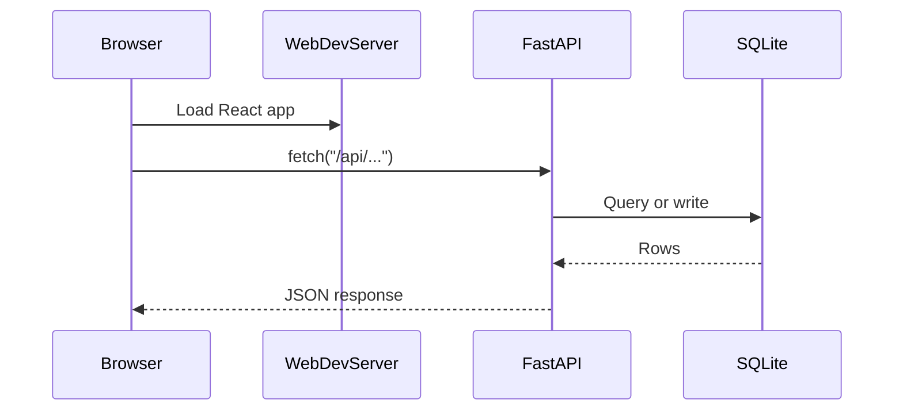

# Plan: Cursor-first fullstack learning repo

## Product goal (important)

This repo’s **core value** is helping her learn how to use **Cursor + GPT‑5.2** to build the capstone outcome herself.

A fully working capstone can exist in the repo, but it must be clearly positioned as:

- a **reference implementation** (for comparison and debugging)
- **not** the primary path (the primary path is the lessons and the learner-built app)

## Learning design principles

- **Build-not-browse**: lessons tell her exactly what to build, and she builds it in the learner codebase.
- **Small diffs**: each lesson introduces 1–3 concepts and results in a visible change in the browser.
- **Explain-back checkpoints**: every lesson ends with 3–5 prompts that require her to explain the code and predict behavior.
- **Objective DoD**: each lesson has tests (or a manual checklist) that defines “done.”
- **Comparison without copying**: provide checkpoints/reference in ways that encourage learning (compare after attempting, not before).

## Scope and target stack

- **Platforms**: macOS only (Apple Silicon + Intel).
- **Frontend**: React from the start (Vite) so progress is always visible in the browser.
- **Backend**: Python **FastAPI** JSON API.
- **Storage**: SQLite (local file) + SQLAlchemy.
- **Auth**: Cookie-based session (simple for beginners) or JWT (explicit API auth). Default in this plan: **cookie session**.
- **Audio**: Store uploads locally in dev (`uploads/`) with a clear path to later S3/R2.

## Repo layout to create

- [`README.md`](/Users/mrhwick/workspace/learning-to-code/README.md)
- [`docs/GETTING_STARTED.md`](/Users/mrhwick/workspace/learning-to-code/docs/GETTING_STARTED.md)
- [`docs/CURSOR_PLAYBOOK.md`](/Users/mrhwick/workspace/learning-to-code/docs/CURSOR_PLAYBOOK.md)
- [`docs/TROUBLESHOOTING.md`](/Users/mrhwick/workspace/learning-to-code/docs/TROUBLESHOOTING.md)
- [`docs/CAPSTONE_SPEC.md`](/Users/mrhwick/workspace/learning-to-code/docs/CAPSTONE_SPEC.md)
- [`docs/REFERENCE_USAGE.md`](/Users/mrhwick/workspace/learning-to-code/docs/REFERENCE_USAGE.md) (how/when to compare to reference without short-circuiting learning)
- [`docs/PROGRESS_TRACKER.md`](/Users/mrhwick/workspace/learning-to-code/docs/PROGRESS_TRACKER.md) (lesson checklist + “explain-back” prompts)
- [`lessons/00-orientation.md`](/Users/mrhwick/workspace/learning-to-code/lessons/00-orientation.md)
- [`lessons/01-ui-first-run.md`](/Users/mrhwick/workspace/learning-to-code/lessons/01-ui-first-run.md)
- … through [`lessons/12-capstone-polish.md`](/Users/mrhwick/workspace/learning-to-code/lessons/12-capstone-polish.md)
- [`apps/web/`](/Users/mrhwick/workspace/learning-to-code/apps/web/) (learner: Vite + React)
- [`apps/api/`](/Users/mrhwick/workspace/learning-to-code/apps/api/) (learner: FastAPI)
- [`reference/`](/Users/mrhwick/workspace/learning-to-code/reference/) (optional: completed capstone reference implementation)
  - `reference/apps/web` and `reference/apps/api` mirror the learner structure for easy diffing
- [`checkpoints/`](/Users/mrhwick/workspace/learning-to-code/checkpoints/) (optional: lesson-by-lesson patch files or notes to jump to expected states)
- [`scripts/dev.sh`](/Users/mrhwick/workspace/learning-to-code/scripts/dev.sh) (one-command local dev)

## Baseline deliverable (clone-and-run)

Create a baseline where, immediately after cloning:

- `./scripts/dev.sh` starts **API** and **web** in dev mode.
- The browser shows a simple React page.
- The page calls the API endpoint (e.g. `GET /health`) and displays the result.
- The learner is directed to start at `lessons/00-orientation.md` and follow the “lesson-as-context” workflow.

## Architecture and data flow (for docs + lessons)

## Capstone app definition (Chinese Practice Studio)

### Core entities

- **User** (teacher or student)
- **Classroom**
- **Enrollment** (user↔classroom)
- **Phrase** (text, pinyin, gloss, notes)
- **ModelAudio** (optional per phrase)
- **Submission** (student audio attempt)
- **Feedback** (comment + rubric scores)

### MVP user stories

- Teacher: sign up/login, create classroom, invite students, create phrases, upload model audio, moderate feedback.
- Student: join classroom, browse phrases, record/upload submission, play model audio and submissions, leave feedback.

## Lesson plan (mapped to capstone skills)

Each lesson file includes: **Goal**, **Concepts**, **DoD**, **Allowed files**, and a **Cursor Agent Contract**.

- **00 Orientation**: how to learn with Cursor; reading diffs; running; asking for explanations.
- **01 UI First Run**: React page + API health check; inspect network tab.
- **02 React Basics**: components, props/state; render phrase cards from mock data.
- **03 API Basics**: FastAPI route, pydantic models; serve phrases from the API.
- **04 DB Persistence**: SQLite + migrations; CRUD for phrases.
- **05 Forms + Validation**: create/edit phrases from the UI; display server-side validation errors.
- **06 Auth**: signup/login/logout; sessions; protect routes.
- **07 Roles + Authorization**: teacher-only phrase creation; student-only submissions; ownership checks.
- **08 Classrooms + Enrollment**: invite codes; class-scoped phrase lists.
- **09 Audio Playback + Upload**: attach model audio; upload a file; serve via secure URL.
- **10 In-browser Recording**: MediaRecorder; upload blob; show playback.
- **11 Feedback + Moderation**: comments + rubric; teacher delete/hide.
- **12 Testing + Polish**: API tests for auth/permissions; UI smoke checks; refactor and document.

## Docs to include (“instructions included”)

- **README**: 5-minute quickstart + what this repo is.
- **GETTING_STARTED**: step-by-step macOS setup (Homebrew, Python, Node), common pitfalls.
- **CURSOR_PLAYBOOK**: how to load a lesson into chat context; good prompt patterns; “explain-back” checkpoints.
- **TROUBLESHOOTING**: ports, CORS, cookie/session issues, sqlite file locks, node/python env issues.
- **CAPSTONE_SPEC**: MVP vs stretch goals, rubric examples for pronunciation feedback, privacy defaults.
- **REFERENCE_USAGE**: rules for using the reference implementation (when to peek, how to diff, how to learn from differences).
- **PROGRESS_TRACKER**: a simple checklist per lesson plus required “explain-back” questions to answer before moving on.

## Implementation approach

- Scaffold the **learner** apps first, with minimal code and a verified request from web→api.
- Then add lessons and ensure each lesson corresponds to:
  - either a **git tag** (e.g. `lesson-03-end`) for the “expected state,” or
  - a **patch file** under `checkpoints/lesson-03-end.patch` (applied only after attempting)
- Create (optional) a **reference implementation** under `reference/` only after the learning path is fully defined, so lessons remain the source of truth.

## Non-goals (to keep learning manageable)

- No production deployment in early lessons.
- No complex realtime features (websockets) in MVP.
- No heavy UI frameworks beyond React (keep CSS simple).
- No hiding complexity via “magic generators” (the point is to learn by building with the agent).

## Open choices (defaults used unless you request changes)

- **Auth**: cookie session (default). If you prefer JWT, swap in Lesson 06.
- **Audio storage**: local filesystem in dev; document path to cloud storage later.

## Implementation todos

- `learning-product-shape`: Add learner-vs-reference structure, progress tracking, and explicit guidance about using Cursor to build.
- `scaffold-monorepo`: Create learner `apps/web` (Vite React) and `apps/api` (FastAPI) with one-command dev script.
- `baseline-api-contract`: Add `/health` and initial `/api/phrases` endpoints with pydantic models.
- `db-and-crud`: Add SQLite + migrations + phrase CRUD.
- `auth-and-roles`: Add login/signup + role checks + protected routes.
- `classrooms-enrollment`: Add classroom creation + invite + enrollment flows.
- `audio-model-upload`: Add model audio upload/serve.
- `submissions-recording`: Add student submissions + MediaRecorder UI.
- `feedback-system`: Add comments/rubric + moderation.
- `docs-and-lessons`: Write docs and lessons with Cursor prompts + DoD per lesson.
- `checkpoints-and-reference`: Add checkpoints and optional reference implementation with strong “how to use” rules.
- `tests`: Add focused API tests for auth/permissions/upload validation.